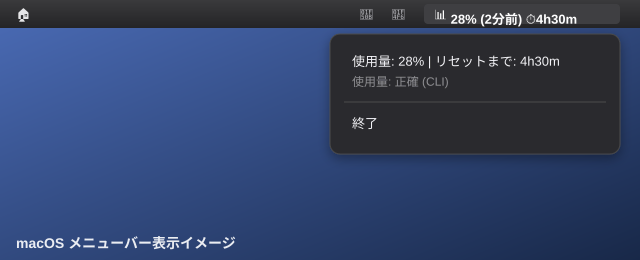

# claude-usage-display

Claude Code の5時間レート制限の使用量を **CLIステータスバー** と **macOSメニューバー** に表示するツールです。



---

## 機能

- `claude` コマンド使用中は、入力欄の下に使用率とリセット時刻をリアルタイムで表示します
- Claude for Desktop 使用中もメニューバーに常時表示され、更新時刻も一緒に確認できます
- バックグラウンドで15分ごとに自動更新するため、CLIを起動していなくてもメニューバーは最新値を保ちます
- PC起動時にもバックグラウンドで即時ポーリングが走るので、ターミナルを開く必要はありません
- Claude Code CLIのセッションが切れたときは、古い数値のまま固まる代わりにメニューバーで警告を表示します

---

## 必要環境

- macOS
- Claude Code CLI（`~/.local/bin/claude`、または `CLAUDE_BIN` 環境変数で指定）
- Python 3.x（Homebrew版推奨: `/usr/local/bin/python3` または `/opt/homebrew/bin/python3`）
- [rumps](https://github.com/jaredks/rumps)（メニューバーアプリ用）

---

## インストール

```bash
# 1. リポジトリをクローン
git clone https://github.com/kenta2107sub-star/claude-usage-display.git
cd claude-usage-display

# 2. rumps をインストール
pip3 install rumps --break-system-packages

# 3. セットアップ実行
bash install.sh
```

`install.sh` を実行すると、以下がまとめて設定されます。

- CLIステータスバーの登録（`~/.claude/settings.json`）
- スクリプトを `~/.claude/` にコピー（LaunchAgentのTCCアクセス制限対策）
- メニューバーアプリのログイン時自動起動（LaunchAgent）
- ログイン時の初回ポーリング・15分ごとのバックグラウンドポーリング（LaunchAgent）

---

## 使い方

インストール後、**再ログイン**（または再起動）すると次のようになります。

1. バックグラウンドでポーラーが自動起動し、キャッシュを即時更新（Terminal不要）
2. メニューバーに `📊 28% (1分前) ⏱4h18m` と表示される
3. 以後15分ごとに自動更新される
4. CLIで会話した場合はリアルタイムに更新される

### メニューバーの表示パターン

| 状況 | 表示 |
|---|---|
| データあり（通常） | `📊 28% (2分前) ⏱4h30m` |
| リセット済み | `📊 0% (5分前)` |
| データなし（初回） | `📊 ?` |
| ログイン切れ | `📊 ⚠️ログイン切れ` |

`(X分前)` は `used_percentage` の最終更新時刻を示します。ポーラーが15分ごとに更新するため、最大15分の遅延が生じます。

「ログイン切れ」はClaude Code CLIのセッションが失効した場合の表示です。ターミナルで `claude` を起動し `/login` を実行すると自動的に解消されます。

---

## ファイル構成

```
claude-usage-display/
├── claude_usage.sh          # CLIステータスバー用スクリプト（settings.jsonから直接参照）
├── menubar_app.py           # macOSメニューバーアプリ（~/.claude/ にコピーして実行）
├── rate_limit_poller.sh     # バックグラウンドポーリング（~/.claude/ にコピーして実行）
├── install.sh               # セットアップスクリプト
└── tests/                   # テスト
```

インストール後は `~/.claude/` にも次のファイルがコピーされます。
- `~/.claude/menubar_app.py`（メニューバーアプリ本体。LaunchAgentの参照先）
- `~/.claude/rate_limit_poller.sh`（ポーラー本体。同じくLaunchAgentの参照先）

---

## 仕組み

Claude Code CLIは `statusLine` スクリプト実行時に **stdin** でレート制限データを渡します。

```json
{
  "rate_limits": {
    "five_hour": {
      "used_percentage": 28,
      "resets_at": 1234567890
    }
  }
}
```

`claude_usage.sh` がこのデータを受け取り、`~/.claude/claude_usage_cache.json` にキャッシュ。メニューバーアプリがそのキャッシュを30秒ごとに読んで表示します。

### Claude for Desktop 対応（バックグラウンドポーリング）

`rate_limit_poller.sh` が15分ごとに Python `pty` モジュールで仮想TTYを作り、バックグラウンドで `claude` インタラクティブセッションを起動して `used_percentage` を取得します。ターミナルウィンドウは開きません。

- CLI または Claude for Desktop のいずれかが**30分以内に活動していれば**実行
- 両方とも30分以上アイドルな場合はスキップ（不要なトークン消費を抑制）
- ポーラーのAPI呼び出しはトークンを消費しますが、Pro/Maxプランでは追加課金なし

### ログイン切れ検知

`rate_limit_poller.sh` はポーリング中に `claude` の出力へ「Login expired」「Not logged in」といったログイン切れメッセージが含まれていないかを確認します。検知した場合はキャッシュに `auth_error` フラグを書き込み、メニューバーに `📊 ⚠️ログイン切れ` を表示します。再ログインして `claude_usage.sh` が正常に発火すると、このフラグは自動的に解除されます。

---

## アンインストール

```bash
# LaunchAgent を停止・削除
launchctl bootout "gui/$(id -u)" ~/Library/LaunchAgents/com.claude-usage.menubar.plist 2>/dev/null
launchctl bootout "gui/$(id -u)" ~/Library/LaunchAgents/com.claude-usage.startup-poll.plist 2>/dev/null
launchctl bootout "gui/$(id -u)" ~/Library/LaunchAgents/com.claude-usage.rate-limit-poller.plist 2>/dev/null
rm -f ~/Library/LaunchAgents/com.claude-usage.menubar.plist
rm -f ~/Library/LaunchAgents/com.claude-usage.startup-poll.plist
rm -f ~/Library/LaunchAgents/com.claude-usage.rate-limit-poller.plist

# settings.json から statusLine を削除
python3 -c "
import json, pathlib
p = pathlib.Path.home() / '.claude/settings.json'
d = json.loads(p.read_text())
d.pop('statusLine', None)
p.write_text(json.dumps(d, indent=2, ensure_ascii=False) + '\n')
print('statusLine を削除しました')
"
```

---

## ライセンス

MIT
